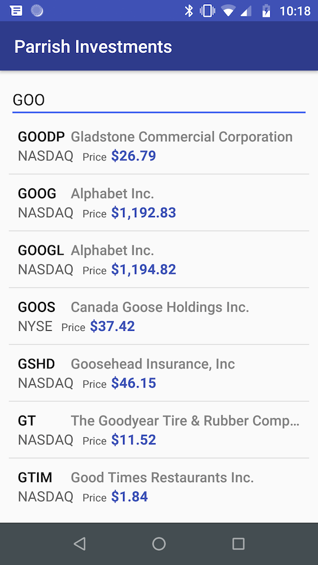

# stock-market
An app to search for stock market symbols and get real-time stock market data

This app uses the RESTful API services at worldtradingdata.com. You can sign up for a free account (or a paid account) and they will give you a key.

ONCE YOU HAVE A KEY YOU NEED TO SET IT IN THE app/gradle.properties file and rebuild.

