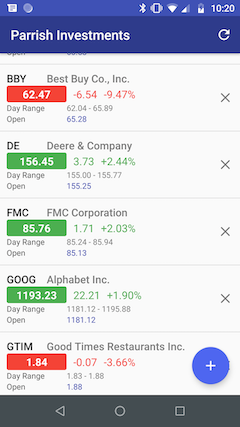
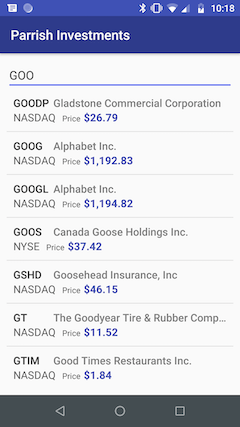

# stock-market
A reliable kotlin app with no ads and real-time data. An app to search for stock market symbols and get real-time stock market data

This app uses the RESTful API services at worldtradingdata.com. 

